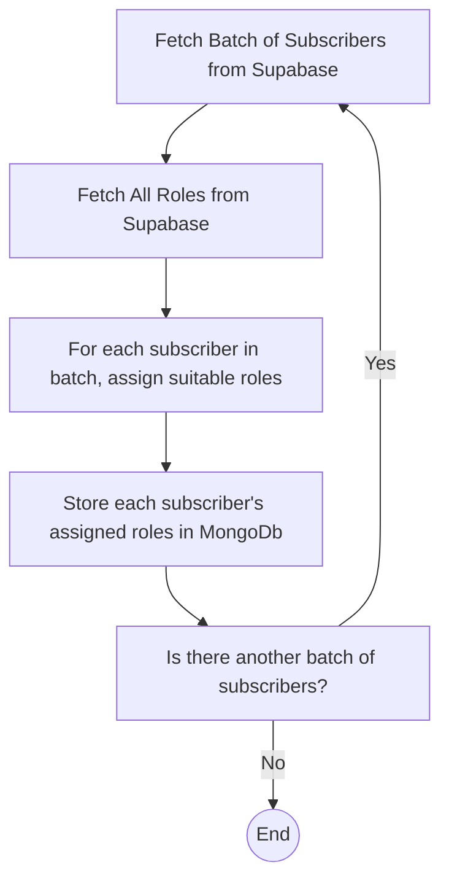
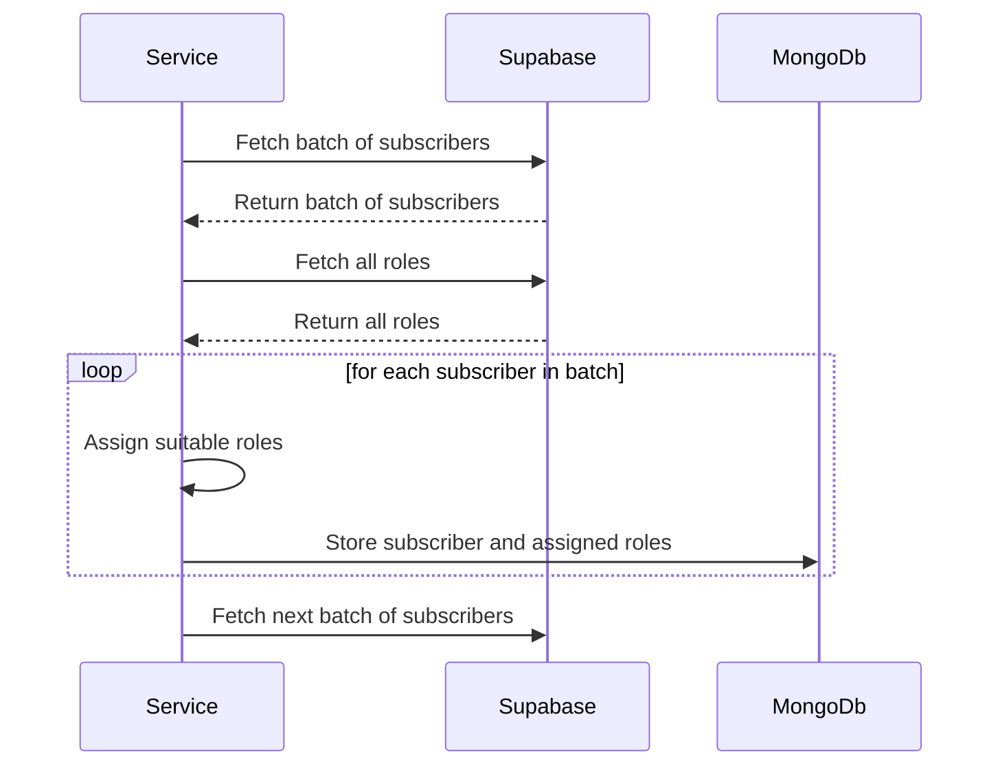

# Roles Assigner Feature Documentation

## Table of Contents

- [Introduction](#introduction)
- [Prerequisites](#prerequisites)
- [Functionality](#functionality)
- [Flow Diagram](#flow-diagram)
- [Sequence Diagram](#sequence-diagram)
- [Key Concepts](#key-concepts)
- [Troubleshooting](#troubleshooting)

## Introduction

Welcome to the documentation of the Roles Assigner feature. This feature:

- Fetches active subscribers and roles from Supabase.
- Assigns roles based on skills, English level, and years of experience.
- Stores assignments in MongoDB.

## Prerequisites

Before proceeding, you should have the following installed on your system:

- Latest versions of Node.js
- MongoDb
- Supabase libraries

Refer to the official documentation for [Node.js](https://nodejs.org/), [MongoDb](https://www.mongodb.com/docs/), and [Supabase](https://supabase.io/) for installation guides.

## Functionality

The Roles Assigner feature:

- Fetches active subscribers and roles from Supabase.
- Matches subscribers with roles based on certain criteria.
- Stores these matches in MongoDb.
- Processes the data in batches to optimize resource utilization.

## Flow Diagram

## Sequence Diagram

## Key Concepts

### Fetching Subscribers and Roles

The service begins by:

- Fetching a batch of active subscribers from Supabase.
- Fetching all active roles.

### Matchmaking and Persistence

The service then:

- Iterates over each subscriber in the batch.
- Matches each subscriber with roles based on their skills, English level, and years of experience.
- Stores these assignments in MongoDb.

### Processing Subscribers in Batches

The service uses a batching mechanism to:

- Fetch and process subscribers in batches.
- Optimize memory usage.
- Handle a large number of subscribers effectively.

### Error Handling

Error handling is essential:

- Errors are caught and logged.
- Error recovery strategies can be implemented as needed.

## Troubleshooting

Common issues include:

- **Fetching Data from Supabase Fails**: Ensure Supabase is correctly configured. Refer to the [Supabase documentation](https://supabase.io/docs/reference/javascript/getting-started).
- **Storing Data in MongoDb Fails**: Check your MongoDb connection and ensure sufficient system resources.
