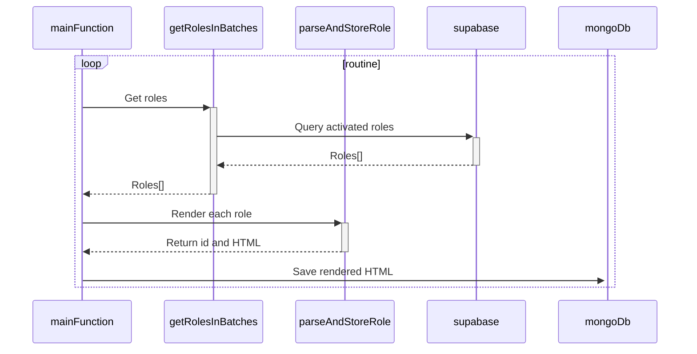

# Render Roles Worker - Readme Documentation

The Render Roles Worker is a software component that renders and saves each activated role from the database into MongoDb.

## Flow Diagram

## Worker Flow

The worker follows the following sequence:

- **Main Function**

  - Responsible for initializing Supabase and MongoDb.
  - Executes `getRolesInBatches` to retrieve roles in batches.
  - While `getRolesInBatches` is in progress, it parses roles into HTML and saves them in MongoDb using `parseAndStoreRole`.

- **getRolesInBatches()**

  - An `AsyncGenerator` function that queries Supabase with simple pagination.
  - Queries roles in small batches and returns them.

- **parseAndStoreRole**
  - Extracts the `id` from the `role` object.
  - Parses the role information into static HTML using the `parseHTML` function.
  - Saves the rendered HTML in the MongoDb database
    - If is an international role, save with the key format `InternationalRolesRenderer:${id}`.
    - If is a national role, save with the key format `NationalRolesRenderer:${id}`.
