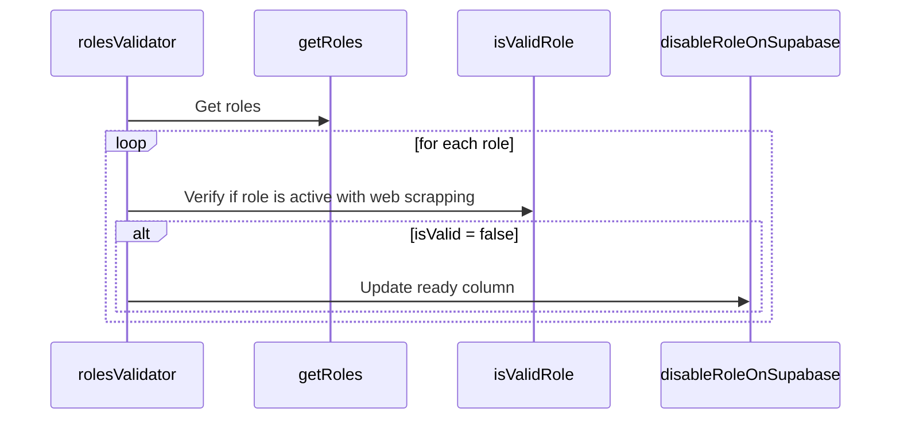

# Roles Validator Feature Documentation

The Roles Validator module is all about checking roles. It uses Supabase to track "roles" availability and does some smart web scraping to determine if are active.

## Worker Flow

The worker follows the following sequence:

## Flow Diagram

### **RolesValidator**

This function is like the conductor of the role-checking orchestra. It relies on Supabase and does some nifty web scraping to handle roles.

How It Works

1. Obtain a list of roles using the getRoles function.
2. For each role in the list:
   - Examine the id, url, and title.
   - If there's no url, use disableRoleOnSupabase to set `ready` column as `false`.
   - If there's a url, use isValidRole to investigate if the role is still active.
   - If it's inactive, use disableRoleOnSupabase to set `ready` column as `false`.

### **getRoles**

This function uses a supabase client to access database and get roles.

### **isValidRole**

The isValidRole.ts file plays the role of a detective, using web scraping as its magnifying glass to discover if roles are active.

How It Works

- Initiate a web browser and navigate to the provided URL using launchBrowserAndNavigateToPage.
- Adjust the view of the webpage using setViewport.
- Utilize web scraping techniques with isValidRoleOnSite to ascertain if the role remains active on the website.
- Close the web browser upon completion.

### **disableRoleOnSupabase**

The `disableRoleOnSupabase` function is a core element in the Roles Validator module. Here, we change the "role" on Supabase, more specifically, we change the "ready" column
