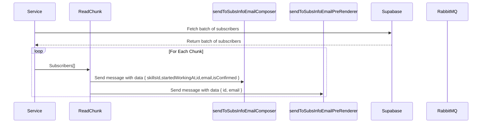

# Subs to queue

The objective of this service is send the necessary database information of `email-pre-renderer` and `email-composer` for a queue `email-pre-renderer-subs` and `email-sender-subs`.

## Prerequisites

Before proceeding, you should have the following installed on your system:

- [RabbitMQ](https://www.rabbitmq.com/documentation.html)
- [Supabase](https://supabase.com/docs)
- [Node 18.16.0](https://nodejs.org/en/blog/release/v18.16.0)

Refer to the official documentation for [Node.js](https://nodejs.org/), [RabbitMQ](https://www.rabbitmq.com/documentation.html), and [Supabase](https://supabase.io/) for installation guides.

## Sequence Diagram

## Functions

### subsToQueue

- Create connection with RabbitMQ and Supabase
- Execute `getAllConfirmedSubscribersPaginated`
- Create a loop for read all chunks

### readChunk

- create a loop for each chunk
- execute `sendToSubsInfoEmailComposer`
- execute `sendToSubsInfoEmailPreRenderer`

### sendToSubsInfoEmailComposer

- send message to `EmailQueues.SubsInfoEmailComposer` queue.

### sendToSubsInfoEmailPreRenderer

- send message to `sendToSubsInfoEmailPreRenderer` queue.

### sendToQueue

A simple abstraction to send a message to RabbitMQ
