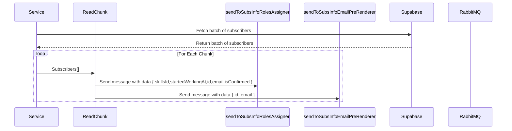

# Subs to queue

The objective of this service is to send the necessary database information of `email-pre-renderer` and `roles-assigner` for a queue of `email-pre-renderer-subs` and `roles-assigner-subs``.

## Prerequisites

Before starting, you'll need:

- [RabbitMQ](https://www.rabbitmq.com/documentation.html)
- [Supabase](https://supabase.com/docs)
- [Node 18.16.0](https://nodejs.org/en/blog/release/v18.16.0)

Refer to the official documentation for [Node.js](https://nodejs.org/), [RabbitMQ](https://www.rabbitmq.com/documentation.html), and [Supabase](https://supabase.io/) for installation guides.

Or, if you're smart, use Docker.

## Flow Diagram

## Sequence Diagram

## Functions

### subsToQueue

Create a connection with RabbitMQ and Supabase

- Execute `getAllConfirmedSubscribersPaginated`
- Create a loop to read all chunks

### readChunk

- create a loop for each chunk
- execute `sendToSubsInfoRolesAssigner`
- execute `sendToSubsInfoEmailPreRenderer`

### sendToSubsInfoRolesAssigner

- send message to `EmailQueues.SubsInfoRolesAssigner` queue.

### sendToSubsInfoEmailPreRenderer

- send message to `EmailQueues.SubsInfoEmailPreRenderer` queue.

### sendToQueue

A simple abstraction to send a message to RabbitMQ
