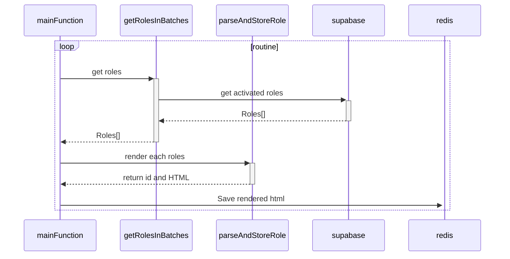

# Render roles worker

This worker render each roles activated on DB, and save on redis database. The all roles key has a default prefix: [`role:`](./src/parseAndStoreRole.ts)

Actually, the worker flux is:

The [`mainFunction`](./src/renderRoles.tsx#6) is responsible to initiate supabase and redis. after this,
execute [`getRolesInBatches`](#getrolesinbatches), and while get getRolesInBatches returns, we parser HTML and save on redis the result with [`parseAndStoreRole`](#parseandstorerolerole)

## getRolesInBatches()

This function is a [AsyncGenerator](https://developer.mozilla.org/en-US/docs/Web/JavaScript/Reference/Global_Objects/AsyncGenerator) and makes a query to supabase with simple pagination. After this, we receives roles in little [batches](https://www.talend.com/resources/batch-processing/) and return.

## parseAndStoreRole(Role[])

This function receives an array of roles and uses role info to render static HTML and save the result on an in-memory database. In this case, redis.
