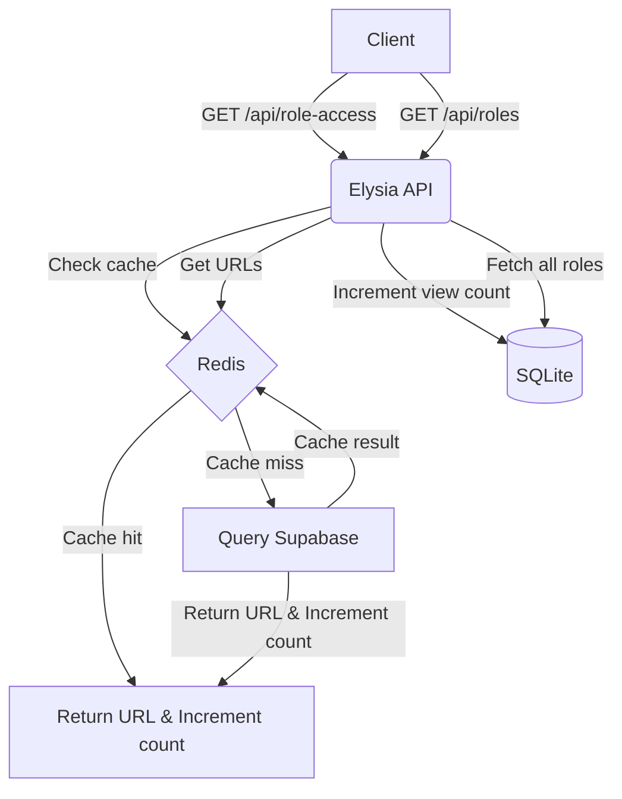

# Role Access API

This application provides an API for managing and accessing roles, with view counting functionality. It uses Supabase for data storage, Redis for caching, and SQLite for local view count tracking.

## Features

- Redirect to role URLs based on role ID
- View count tracking for each role
- Caching of ready roles in Redis
- Fetch all roles with their view counts

## Technologies Used

- Bun.js
- Elysia.js (for API routing)
- Supabase (main database)
- Redis (caching)
- SQLite (local view count storage)

## Architecture Overview



## API Endpoints

1. `GET /api/role-access`

   - Query params: `roleId`
   - Redirects to the role URL and increments view count
   - Returns view count in `X-View-Count` header

2. `GET /api/roles`
   - Returns all roles with their IDs, URLs, and view counts

## Setup

1. Set the following environment variables:

   - `SUPABASE_URL`
   - `SUPABASE_ANON_KEY`
   - `REDIS_URL`

2. Install dependencies:

   ```
   bun install
   ```

3. Run the server:
   ```
   bun run index.ts
   ```

The server will start on port 5500 by default.

## Data Flow

1. When a client requests a role access:

   - The system checks Redis for the role URL
   - If not found, it queries Supabase and caches the result in Redis
   - The view count is incremented in SQLite
   - The client is redirected to the role URL

2. When fetching all roles:
   - View counts are retrieved from SQLite
   - URLs are fetched from Redis
   - The combined data is returned to the client

## Caching Strategy

- Ready roles are cached in Redis on startup
- Role URLs are cached in Redis after the first access
- View counts are stored locally in SQLite for quick access and updates

This architecture ensures fast response times and reduces load on the Supabase database.
