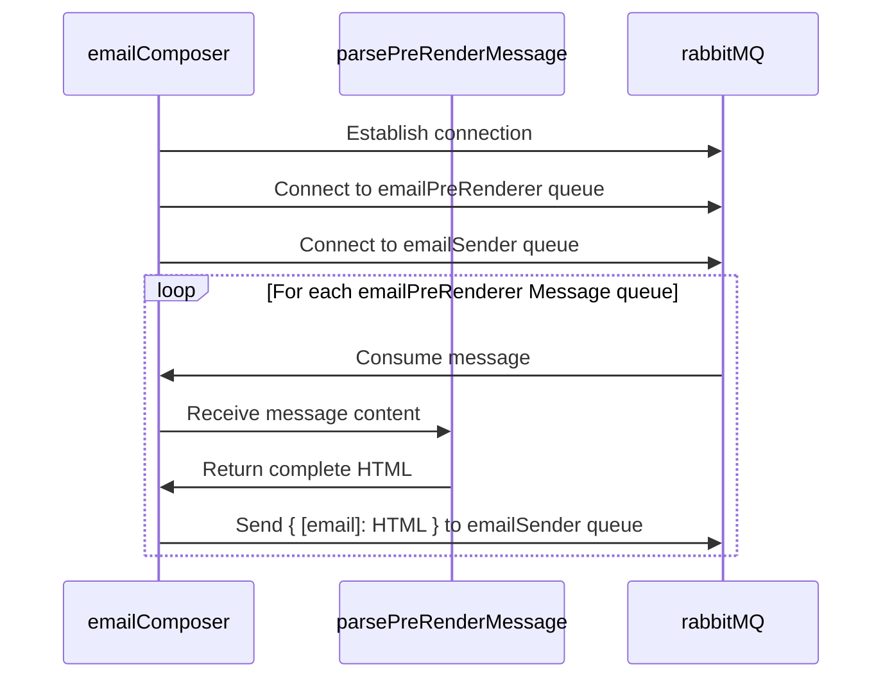

# Email Composer Feature Documentation

This documentation provides an overview of the Email Composer and Pre-Render feature, outlining the core components, workflows, and interactions within the system.

## Table of Contents

- [Introduction](#introduction)
- [Prerequisites](#prerequisites)
- [Flow Diagram](#flow-diagram)
- [Sequence Diagram](#sequence-diagram)

## Introduction

The Email Composer and Pre-Render feature is a vital aspect of the application, responsible for generating and delivering personalized email content to recipients. This documentation explains the key modules involved in composing, rendering, and delivering emails within the system.

## Prerequisites

Before proceeding, you should have the following installed on your system:

- Latest versions of Node.js
- RabbitMQ

Refer to the official documentation for [Node.js](https://nodejs.org/) and
[RabbitMQ](https://www.rabbitmq.com/monitoring.html) for installation guides.

## Functionality

- Establishing connections to the EmailPreRenderer and EmailSender RabbitMQ queue.
- For each message on EmailPreRenderer queue
  - Parse message
  - Use footer, header, and roles to compose email
  - Send to EmailSender queue

## Flow Diagram

## Sequence Diagram

