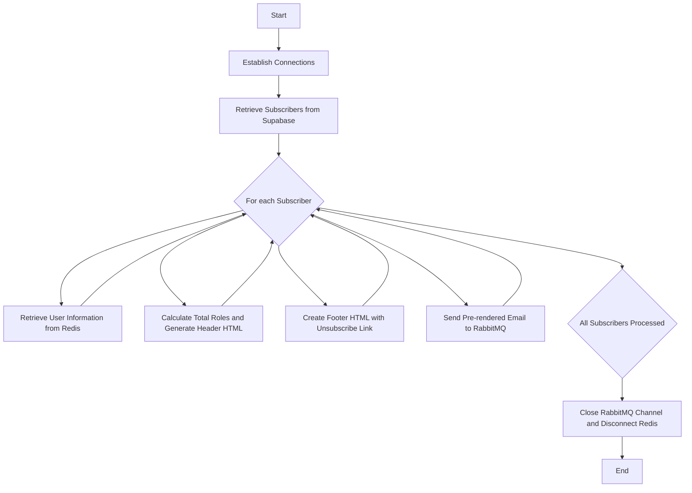
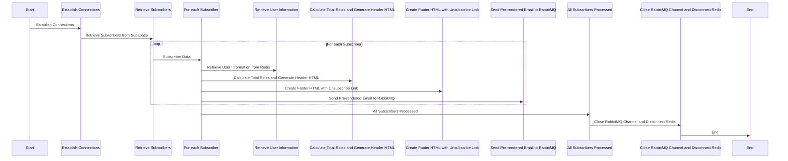

# Email Pre Renderer Feature Documentation

## Table of Contents

- [Introduction](#introduction)
- [Prerequisites](#prerequisites)
- [Functionality](#functionality)
- [Flow Diagram](#flow-diagram)
- [Sequence Diagram](#sequence-diagram)
- [Key concepts](#key-concepts)

## Introduction

- Utilizes Redis and Supabase for seamless data retrieval.
- Generates personalized email templates (headers and footers) for each subscriber.
- Sends pre-rendered templates to a RabbitMQ queue.

## Prerequisites

Before proceeding, you should have the following installed on your system:

- Latest versions of Node.js
- Redis
- Supabase libraries
- RabbitM

Refer to the official documentation for [Node.js](https://nodejs.org/),
[Redis](https://redis.io/),
[Supabase](https://supabase.io/) and
[RabbitMQ](https://www.rabbitmq.com/monitoring.html) for installation guides.

## Functionality

- Establishing connections to the Redis client and RabbitMQ queue.
- Retrieving subscribers in batches from Supabase.
- For each subscriber:
  - Retrieving persisted user information (roles) from Redis using the subscriber's ID.
  - Calculating the total number of roles and generating the header HTML.
  - Creating the footer HTML with an injected unsubscribe link.
  - Sending the pre-rendered email template, including subscriber's email, roles, footer HTML, and header HTML, to the RabbitMQ queue.

## Flow Diagram

## Sequence Diagram

## Key concepts

Pre-rendering Email Templates:

### Generates personalized email content, including headers and footers, for subscribers.

- Ensures tailored email templates based on individual preferences.
- Enhances engagement through personalized communication.
- Data Retrieval with Redis and Supabase:

### Seamlessly interacts with Redis and Supabase for data retrieval.

- Utilizes Redis to store and retrieve persisted user information, like roles.
- Facilitates efficient retrieval of subscriber data in batches with Supabase.
- Header and Footer Generation:

### Calculates the total number of roles and includes it in the header HTML.

- Creates footer HTML with an unsubscribe link for subscriber opt-out.
- Customizes header and footer for each subscriber's email template.
- Queueing for Further Processing:

### Queues pre-rendered email templates for subsequent handling.

- Enables efficient distribution of email templates using RabbitMQ.
- Facilitates organized and scalable email processing.
- Batch Processing:

### Optimizes performance by processing subscribers in batches.

- Smoothly handles large numbers of subscribers without system overload.
- Reduces processing time and resource utilization.
