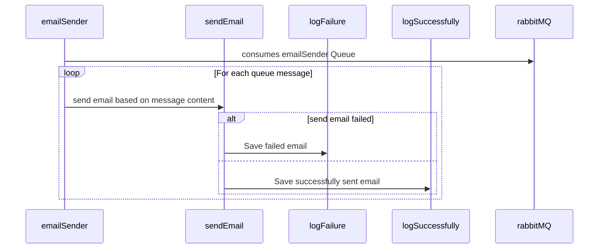

# Email Sender Feature Documentation

The Email Sender module is a critical component responsible for dispatching email messages to recipients. It utilizes RabbitMQ for message queuing and the Resend library for email transmission. This documentation provides insights into the main functions involved in the email sending process.

## Table of Contents

- [Introduction](#introduction)
- [Prerequisites](#prerequisites)
- [Functionality](#functionality)
- [Flow Diagram](#flow-diagram)
- [Sequence Diagram](#sequence-diagram)
- [Key concepts](#key-concepts)

## Introduction

The Email Sender feature is an integral part of the application, responsible for efficiently dispatching email messages to recipients. This documentation provides an in-depth overview of the feature's core components, functionality, and key concepts.

## Prerequisites

Before proceeding, you should have the following installed on your system:

- Latest versions of Node.js
- Supabase libraries
- RabbitMQ

Refer to the official documentation for [Node.js](https://nodejs.org/),
[Supabase](https://supabase.io/) and
[RabbitMQ](https://www.rabbitmq.com/monitoring.html) for installation guides.

## Functionality

- The emailSender function serves as the main orchestrator of the email sending process.
- It establishes a connection to the RabbitMQ channel for email consumption.
- A Resend instance is created, enabling email transmission using the Resend library.
- Email composer items are retrieved from the RabbitMQ queue for processing.
- Email composer items are divided into manageable chunks to optimize processing.
- For each chunk
  - sendEmail function is invoked to send individual emails.
  - Successful email deliveries are logged, and the corresponding emails are recorded as sent.
  - Failed email deliveries are logged, along with the affected emails, in the "failed-emails.txt" file.

## Flow Diagram

## Sequence Diagram

## Key Concepts

### Efficient Chunk Processing

Email sending is optimized by processing email composer items in manageable chunks. This approach ensures performance scalability and resource utilization.

### Reliable Logging

Detailed logging of email sending status enhances transparency and enables effective monitoring of successful and failed email deliveries.
